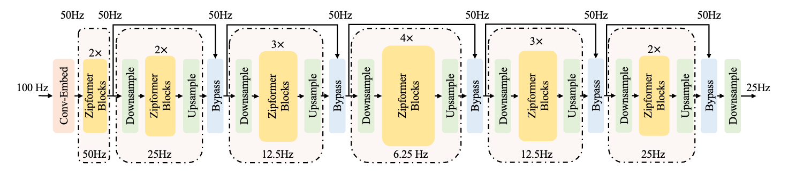
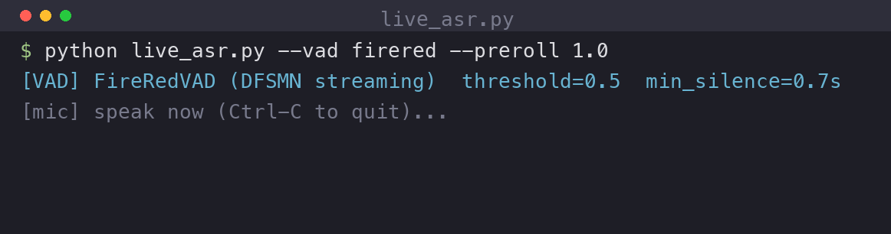
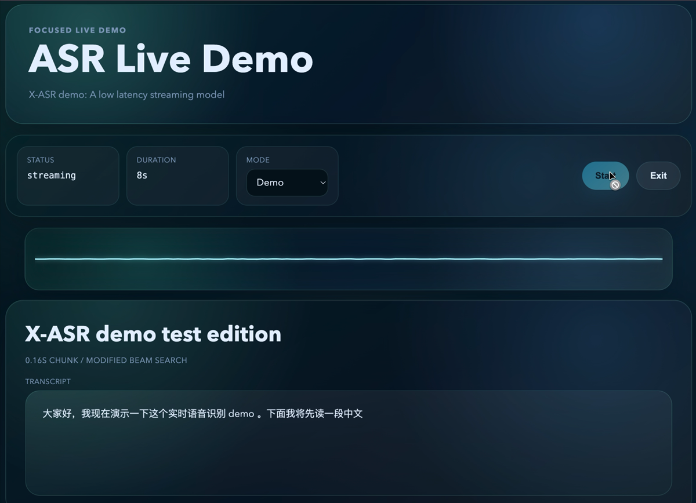

<h1 align="center">🎙️ X-ASR</h1>

<p align="center">
  <b>Streaming-focused automatic speech recognition models based on icefall/k2, Zipformer, and sherpa-onnx.</b>
</p>

<table align="center" border="0" cellspacing="0" cellpadding="0">
  <tr>
    <td align="center" width="25%" style="border: none; padding: 0 14px;">
      <a href="https://www.sjtu.edu.cn/"></a>
    </td>
    <td align="center" width="25%" style="border: none; padding: 0 14px;">
      <a href="https://www.sii.edu.cn/"></a>
    </td>
    <td align="center" width="25%" style="border: none; padding: 0 14px;">
      <a href="https://www.fudan.edu.cn/en/"></a>
    </td>
    <td align="center" width="25%" style="border: none; padding: 0 14px;">
      <a href="https://www.hust.edu.cn/"></a>
    </td>
  </tr>
</table>

<p align="center">
  <sub><b>Participating Institutions</b></sub>
</p>

<p align="center">
  <b>🌐 <a href="README_zh.md">中文版</a></b>
</p>

<p align="center">
  <a href="https://huggingface.co/GilgameshWind/X-ASR-zh-en">🤗 Hugging Face Hub</a> |
  <a href="https://huggingface.co/spaces/chenxie95/X-ASR">🪐 Hugging Face Space</a> |
  <a href="https://stream-asr.sjtuxlance.com/">🎧 Online Demo</a> |
  <a href="X-ASR-zh-en/deployment/x-asr-live-demo/README.md">🎙️ Local Live Demo</a> |
  <a href="X-ASR-zh-en/deployment/README.md">🚀 Deployment Guide</a>
</p>

<p align="center">
  <b>📄 X-ASR-zh-en Technical Report: Coming Soon</b>
</p>

<p align="center">
  
  
  
  
  
</p>

<p align="center">
  <a href="#overview">🔍 Overview</a> |
  <a href="#timeline">📅 Timeline</a> |
  <a href="#model-releases">📦 Model Releases</a> |
  <a href="#applications">🎙️ Applications</a> |
  <a href="#evaluation">📊 Evaluation</a> |
  <a href="#quick-start">🚀 Quick Start</a>
</p>

---

<a id="overview"></a>

## 🔍 Overview

### 🧩 X-ASR

**X-ASR** is a series of automatic speech recognition models built with the **icefall** framework. The series focuses on **streaming ASR** and **low-latency deployment**, while also supporting offline recognition. This repository currently releases an initial batch of **Chinese-English streaming ASR models**, and the X-ASR series will be continuously maintained, updated, and scaled across **languages**, **model architectures**, and **training data**.

### 🤖 X-ASR-zh-en

**X-ASR-zh-en** is trained on approximately **1 million hours** of open-source and collected speech data. It is designed as an **offline-streaming unified transducer ASR model** with the **Zipformer architecture**, supporting both **offline decoding** and **true streaming decoding**. The model provides multiple streaming chunk sizes: **160 ms**, **480 ms**, **960 ms**, and **1920 ms**, supports **punctuation and casing**, and can be conveniently deployed with **sherpa-onnx**.

<p align="center">
  
</p>

<a id="timeline"></a>

## 📅 Timeline

| Status | Item | Details |
|:---:|:---:|:---:|
| ✅ Released | `X-ASR-zh-en` initial release | Chinese-English offline-streaming unified ASR models, sherpa-onnx deployment artifacts, and online demo are available. |
| 📄 Coming Soon | `X-ASR-zh-en` technical report | Training recipe, model architecture, evaluation protocol, deployment details, and ablation analysis will be released. |
| 🌏 Upcoming | Thai, Indonesian, and Vietnamese ASR | Streaming ASR models for the next language releases are under preparation. |
| 🔄 Ongoing | Model and data updates | Continued work on model scaling, architecture improvements, data refinement, latency, stability, punctuation, and casing. |

<a id="model-releases"></a>

## 📦 Model Releases

| Model | Languages | Type | Streaming chunks | Deployment | Report | Model files |
|:---:|:---:|:---:|:---:|:---:|:---:|:---:|
| `X-ASR-zh-en` | Chinese, English | Offline-streaming unified transducer ASR | 160 ms, 480 ms, 960 ms, 1920 ms | sherpa-onnx | **Coming Soon** | [GitHub](X-ASR-zh-en/deployment), [Hugging Face](https://huggingface.co/GilgameshWind/X-ASR-zh-en) |

## ⭐ Highlights

| Category | Description |
|:---:|:---:|
| **Framework** | icefall / k2 |
| **Architecture** | Zipformer transducer |
| **Training scale** | Approximately 1 million hours of open-source and collected speech data |
| **Current languages** | Chinese and English |
| **Decoding modes** | Offline decoding and true streaming decoding |
| **Streaming chunks** | 160 ms, 480 ms, 960 ms, 1920 ms |
| **Text output** | Supports punctuation and casing |
| **Runtime** | sherpa-onnx |
| **Interface** | WebSocket streaming server and WAV-file client |

<a id="applications"></a>

## 🎙️ Applications

X-ASR is released with runnable application examples that show how the model can be used beyond benchmark evaluation. The latest contribution focuses on **local offline live recognition**, **VAD-based endpointing**, and practical voice-input workflows for **vibe-coding**.

### 🧪 New PR: Local Offline Vibe-Coding with VAD

<table>
  <tr>
    <td width="100%" valign="top" align="center">
      <a href="X-ASR-zh-en/deployment/x-asr-live-demo/README.md">
        
      </a>
      <br>
      <b>Local Offline Live ASR Demo</b>
      <br>
      <sub>Microphone/WAV → VAD endpointing → X-ASR streaming decoding → live partial/final output. Designed for local dictation, voice-input prototypes, and vibe-coding workflows.</sub>
      <br><br>
      <a href="X-ASR-zh-en/deployment/x-asr-live-demo/README.md"><b>Open Guide</b></a> ·
      <a href="X-ASR-zh-en/deployment/x-asr-live-demo/README_zh.md">中文</a>
    </td>
  </tr>
</table>

<a id="evaluation"></a>

## 📊 Evaluation

The following results are for the current **X-ASR-zh-en** release. All results are reported with **greedy search**. **Measurement:** English results use **WER (%)**, and Chinese results use **CER (%)**; lower is better.

### 🧪 Public ASR Benchmarks

<table>
  <thead>
    <tr>
      <th align="center" rowspan="2">⚙️ Mode</th>
      <th align="center" rowspan="2">⏱️ Chunk size</th>
      <th align="center" colspan="2">📚 LibriSpeech</th>
      <th align="center" rowspan="2">🎙️ GigaSpeech</th>
      <th align="center" colspan="2">🗣️ WenetSpeech</th>
    </tr>
    <tr>
      <th align="center">clean</th>
      <th align="center">other</th>
      <th align="center">net</th>
      <th align="center">meeting</th>
    </tr>
  </thead>
  <tbody>
    <tr>
      <td align="center">Streaming</td>
      <td align="center">160 ms</td>
      <td align="center">3.49</td>
      <td align="center">8.75</td>
      <td align="center">10.32</td>
      <td align="center">8.72</td>
      <td align="center">10.47</td>
    </tr>
    <tr>
      <td align="center">Streaming</td>
      <td align="center">480 ms</td>
      <td align="center">2.99</td>
      <td align="center">7.36</td>
      <td align="center">9.70</td>
      <td align="center">7.46</td>
      <td align="center">9.11</td>
    </tr>
    <tr>
      <td align="center">Streaming</td>
      <td align="center">960 ms</td>
      <td align="center">2.87</td>
      <td align="center">6.77</td>
      <td align="center">9.59</td>
      <td align="center">6.97</td>
      <td align="center">8.40</td>
    </tr>
    <tr>
      <td align="center">Streaming</td>
      <td align="center">1920 ms</td>
      <td align="center">2.75</td>
      <td align="center">6.33</td>
      <td align="center">9.43</td>
      <td align="center">6.58</td>
      <td align="center">7.88</td>
    </tr>
    <tr>
      <td align="center">Offline</td>
      <td align="center">-</td>
      <td align="center"><b>2.56</b></td>
      <td align="center"><b>5.56</b></td>
      <td align="center"><b>9.17</b></td>
      <td align="center"><b>5.83</b></td>
      <td align="center"><b>7.06</b></td>
    </tr>
  </tbody>
</table>

**Note:** Bold numbers indicate the best result among the listed modes for each benchmark column.

### 🏆 Public Benchmark Model Comparison

The following table compares representative ASR models on the same public benchmark columns. Ranks are computed by **AVG** across the five listed columns; lower is better. Parameter sizes are shown when provided by the source sheet.

<table>
  <thead>
    <tr>
      <th align="center" rowspan="2">🏅 Rank</th>
      <th align="center" rowspan="2">Model</th>
      <th align="center" rowspan="2">Params</th>
      <th align="center" colspan="2">📚 LibriSpeech</th>
      <th align="center" rowspan="2">🎙️ GigaSpeech</th>
      <th align="center" colspan="2">🗣️ WenetSpeech</th>
      <th align="center" rowspan="2">AVG</th>
    </tr>
    <tr>
      <th align="center">clean</th>
      <th align="center">other</th>
      <th align="center">net</th>
      <th align="center">meeting</th>
    </tr>
  </thead>
  <tbody>
    <tr><td align="center">1</td><td align="center">Qwen3-ASR</td><td align="center">1.7B</td><td align="center">1.65</td><td align="center">3.45</td><td align="center">8.56</td><td align="center">5.29</td><td align="center">5.46</td><td align="center"><b>4.882</b></td></tr>
    <tr><td align="center">2</td><td align="center">Qwen3-ASR</td><td align="center">0.6B</td><td align="center">2.18</td><td align="center">4.54</td><td align="center">8.94</td><td align="center">5.97</td><td align="center">6.88</td><td align="center">5.702</td></tr>
    <tr><td align="center">3</td><td align="center"><b>X-ASR-zh-en</b> (offline)</td><td align="center">0.16B</td><td align="center">2.56</td><td align="center">5.56</td><td align="center">9.17</td><td align="center">5.83</td><td align="center">7.06</td><td align="center">6.036</td></tr>
    <tr><td align="center">4</td><td align="center">SenseVoice-small</td><td align="center">234M</td><td align="center">3.16</td><td align="center">7.21</td><td align="center">11.24</td><td align="center">5.73</td><td align="center">6.47</td><td align="center">6.762</td></tr>
    <tr><td align="center">5</td><td align="center">VibeVoice-ASR</td><td align="center">9B</td><td align="center">2.18</td><td align="center">5.65</td><td align="center">9.49</td><td align="center">14.45</td><td align="center">17.19</td><td align="center">9.792</td></tr>
  </tbody>
</table>

### 🧭 Vertical-Domain Benchmarks

The following results report **GigaSpeechBench vertical-domain** performance for the current **X-ASR-zh-en** release. Values are **WER/CER percentages**; lower is better. Domain abbreviations follow the GigaSpeechBench vertical-domain labels.

#### CH

<table>
  <thead>
    <tr>
      <th align="center">⚙️ Mode</th>
      <th align="center">⏱️ Chunk size</th>
      <th align="center">ARG</th>
      <th align="center">AIT</th>
      <th align="center">ART</th>
      <th align="center">BIO</th>
      <th align="center">ECM</th>
      <th align="center">ENG</th>
      <th align="center">ENT</th>
      <th align="center">FIN</th>
      <th align="center">HUM</th>
      <th align="center">LAW</th>
      <th align="center">MED</th>
      <th align="center">MIL</th>
    </tr>
  </thead>
  <tbody>
    <tr><td align="center">Streaming</td><td align="center">160 ms</td><td align="center">9.88</td><td align="center">6.76</td><td align="center">4.39</td><td align="center">7.32</td><td align="center">4.13</td><td align="center">3.58</td><td align="center">8.45</td><td align="center">3.23</td><td align="center">10.42</td><td align="center">6.58</td><td align="center">4.25</td><td align="center">2.55</td></tr>
    <tr><td align="center">Streaming</td><td align="center">480 ms</td><td align="center">8.67</td><td align="center">6.17</td><td align="center">3.60</td><td align="center">6.22</td><td align="center">3.78</td><td align="center">3.04</td><td align="center">7.04</td><td align="center">2.78</td><td align="center">9.43</td><td align="center">5.84</td><td align="center">3.76</td><td align="center">2.11</td></tr>
    <tr><td align="center">Streaming</td><td align="center">960 ms</td><td align="center">8.00</td><td align="center">5.69</td><td align="center">3.44</td><td align="center">6.10</td><td align="center">3.69</td><td align="center">2.88</td><td align="center">6.71</td><td align="center">2.72</td><td align="center">9.07</td><td align="center">5.58</td><td align="center">3.69</td><td align="center">2.11</td></tr>
    <tr><td align="center">Streaming</td><td align="center">1920 ms</td><td align="center">7.24</td><td align="center">5.58</td><td align="center">3.27</td><td align="center">5.82</td><td align="center">3.48</td><td align="center">2.74</td><td align="center">6.55</td><td align="center">2.57</td><td align="center">8.59</td><td align="center">4.97</td><td align="center">3.53</td><td align="center">1.94</td></tr>
    <tr><td align="center">Offline</td><td align="center">-</td><td align="center"><b>6.56</b></td><td align="center"><b>4.54</b></td><td align="center"><b>2.77</b></td><td align="center"><b>5.04</b></td><td align="center"><b>2.99</b></td><td align="center"><b>2.32</b></td><td align="center"><b>6.02</b></td><td align="center"><b>1.94</b></td><td align="center"><b>7.64</b></td><td align="center"><b>4.20</b></td><td align="center"><b>2.90</b></td><td align="center"><b>1.68</b></td></tr>
  </tbody>
</table>

#### EN

<table>
  <thead>
    <tr>
      <th align="center">⚙️ Mode</th>
      <th align="center">⏱️ Chunk size</th>
      <th align="center">ARG</th>
      <th align="center">AIT</th>
      <th align="center">ART</th>
      <th align="center">BIO</th>
      <th align="center">ECM</th>
      <th align="center">ENG</th>
      <th align="center">ENT</th>
      <th align="center">FIN</th>
      <th align="center">HUM</th>
      <th align="center">LAW</th>
      <th align="center">MED</th>
      <th align="center">MIL</th>
    </tr>
  </thead>
  <tbody>
    <tr><td align="center">Streaming</td><td align="center">160 ms</td><td align="center">5.29</td><td align="center">8.57</td><td align="center">8.55</td><td align="center">7.31</td><td align="center">4.33</td><td align="center">5.01</td><td align="center">16.25</td><td align="center">5.58</td><td align="center">7.36</td><td align="center">13.39</td><td align="center">6.03</td><td align="center">6.20</td></tr>
    <tr><td align="center">Streaming</td><td align="center">480 ms</td><td align="center">4.62</td><td align="center">8.40</td><td align="center">7.73</td><td align="center">6.12</td><td align="center">4.19</td><td align="center">4.65</td><td align="center">14.50</td><td align="center">5.21</td><td align="center">6.79</td><td align="center">11.51</td><td align="center">5.59</td><td align="center">6.02</td></tr>
    <tr><td align="center">Streaming</td><td align="center">960 ms</td><td align="center">4.58</td><td align="center">8.35</td><td align="center">7.45</td><td align="center">6.00</td><td align="center">4.13</td><td align="center">4.44</td><td align="center">13.99</td><td align="center">5.12</td><td align="center">6.58</td><td align="center">10.86</td><td align="center">5.52</td><td align="center">6.04</td></tr>
    <tr><td align="center">Streaming</td><td align="center">1920 ms</td><td align="center">4.33</td><td align="center">8.32</td><td align="center">6.90</td><td align="center">5.89</td><td align="center"><b>4.00</b></td><td align="center">4.37</td><td align="center">13.61</td><td align="center">4.98</td><td align="center">6.39</td><td align="center">10.52</td><td align="center">5.45</td><td align="center">5.78</td></tr>
    <tr><td align="center">Offline</td><td align="center">-</td><td align="center"><b>4.09</b></td><td align="center"><b>8.28</b></td><td align="center"><b>6.73</b></td><td align="center"><b>5.48</b></td><td align="center">4.12</td><td align="center"><b>4.30</b></td><td align="center"><b>12.30</b></td><td align="center"><b>4.94</b></td><td align="center"><b>6.17</b></td><td align="center"><b>10.41</b></td><td align="center"><b>5.35</b></td><td align="center"><b>5.61</b></td></tr>
  </tbody>
</table>

## 🎧 Demo

A **sherpa-onnx based online demo** is available here:

- [https://stream-asr.sjtuxlance.com/](https://stream-asr.sjtuxlance.com/)

Demo video:

<a href="assets/demos/demo.mov">
  
</a>

[Open demo video](assets/demos/demo.mov)

<a id="quick-start"></a>

## 🚀 Quick Start

This section shows how to build and run the **sherpa-onnx WebSocket streaming server** and the corresponding **WebSocket client**. For complete deployment arguments, model switching, runtime options, and production notes, see the [deployment guide](X-ASR-zh-en/deployment/README.md).

### 1. Clone or download model artifacts

This repository uses **Git LFS** for ONNX model artifacts and demo media. Install Git LFS before cloning or before pulling large files.

```bash
git lfs install
git clone https://github.com/Gilgamesh-J/X-ASR.git
cd X-ASR
git lfs pull
```

Alternatively, download the model artifacts from Hugging Face:

```bash
hf download GilgameshWind/X-ASR-zh-en \
  --local-dir ./X-ASR-zh-en/deployment
```

### 2. Prepare the sherpa-onnx runtime

```bash
cd X-ASR-zh-en/deployment
python -m venv .venv
source .venv/bin/activate
python -m pip install --upgrade pip
python -m pip install -r requirements.txt
```

### 3. Start the WebSocket server

The server wraps `sherpa_onnx.OnlineRecognizer` and exposes a WebSocket endpoint. Each WebSocket connection keeps an independent recognizer session, so concurrent clients do not share decoding state. The example below starts the **160 ms streaming model** on CPU and listens on `ws://0.0.0.0:6666`.

```bash
python infer_and_client/sherpa_streaming_server.py \
  --host 0.0.0.0 \
  --port 6666 \
  --tokens models/chunk-160ms-model/tokens.txt \
  --encoder models/chunk-160ms-model/encoder-160ms.onnx \
  --decoder models/chunk-160ms-model/decoder-160ms.onnx \
  --joiner models/chunk-160ms-model/joiner-160ms.onnx \
  --provider cpu \
  --sample-rate 16000 \
  --feature-dim 80 \
  --decoding-method greedy_search \
  --model-type zipformer2 \
  --text-format none
```

The `--tokens`, `--encoder`, `--decoder`, and `--joiner` files must come from the same model directory.

### 4. Run the WebSocket client

Open another terminal:

```bash
cd X-ASR-zh-en/deployment
source .venv/bin/activate

python infer_and_client/sherpa_streaming_client.py \
  --server-uri ws://127.0.0.1:6666 \
  --wav /path/to/test.wav \
  --chunk-ms 100 \
  --simulate-realtime 1
```

The client loads a WAV file, converts or resamples it to **16 kHz mono int16 PCM**, sends binary PCM chunks over WebSocket, and prints partial/final recognition results returned by the server. With `--simulate-realtime 1`, `--chunk-ms 100` means one audio packet is sent roughly every 100 ms.

### 5. WebSocket protocol

The provided client and server use a minimal streaming protocol:

| Step | Message | Purpose |
|:---:|:---|:---|
| 1 | JSON: `{"type": "start", "sample_rate": 16000}` | Start one recognition session |
| 2 | Binary: int16 PCM audio chunks | Stream audio to the recognizer |
| 3 | JSON: `{"type": "end"}` | Finish the session and flush final results |

For detailed deployment instructions, see [X-ASR-zh-en/deployment/README.md](X-ASR-zh-en/deployment/README.md).

## 🗂️ Repository Layout

```text
X-ASR/
|-- README.md
|-- README_zh.md
|-- LICENSE
|-- assets/
|   |-- figures/
|   |   |-- demo-preview.png
|   |   `-- zipformer.png
|   |-- demos/
|   |   `-- demo.mov
|   `-- institutions/
|       |-- sjtu.png
|       |-- sii.png
|       |-- fudan.png
|       `-- hust.png
`-- X-ASR-zh-en/
    |-- deployment/
    |   |-- README.md
    |   |-- requirements.txt
    |   |-- infer_and_client/
    |   |   |-- sherpa_streaming_infer.py
    |   |   |-- sherpa_streaming_server.py
    |   |   `-- sherpa_streaming_client.py
    |   |-- x-asr-live-demo/
    |   |   |-- README.md
    |   |   |-- README_zh.md
    |   |   |-- live_asr.py
    |   |   |-- download_models.sh
    |   |   |-- requirements.txt
    |   |   `-- assets/
    |   `-- models/
    |       |-- README.md
    |       |-- chunk-160ms-model/
    |       |-- chunk-480ms-model/
    |       |-- chunk-960ms-model/
    |       `-- chunk-1920ms-model/
    `-- zipformer/
        |-- README.md
        |-- train.py
        |-- finetune.py
        |-- decode.py
        |-- streaming_decode.py
        |-- export.py
        |-- export-onnx.py
        |-- export-onnx-streaming.py
        |-- model.py
        |-- zipformer.py
        |-- data/
        |   |-- lang_5000/
        |   |   |-- bpe.model
        |   |   `-- tokens.txt
        |   `-- lang_5000_with_punctuation/
        |       |-- bpe_punc.model
        |       `-- tokens.txt
        `-- checkpoint/
            |-- pretrained.pt
            `-- fintuned_with_punctuation.pt
```

`X-ASR-zh-en/deployment/` contains runnable sherpa-onnx deployment artifacts, including the WebSocket server/client path and the local live ASR application demo. `X-ASR-zh-en/zipformer/` contains the icefall/Zipformer training, decoding, export recipe files, tokenizer/data files, and released PyTorch checkpoints for the model.

## 🤝 Contributing

We welcome feedback and contributions in the following areas:

- Deployment issues on different CPU/GPU environments
- Streaming latency and stability reports
- Evaluation results on new datasets or domains
- Requests for new languages or future releases
- Improvements to documentation and examples

When reporting deployment problems, please include the **environment**, **command**, **input audio format**, and **error log**.

## 📜 License

This project is released under the **Apache-2.0 License**.

## 🙏 Acknowledgements

This model series is trained with **icefall** and deployed with **sherpa-onnx**.

- icefall: https://github.com/k2-fsa/icefall
- sherpa-onnx: https://github.com/k2-fsa/sherpa-onnx
